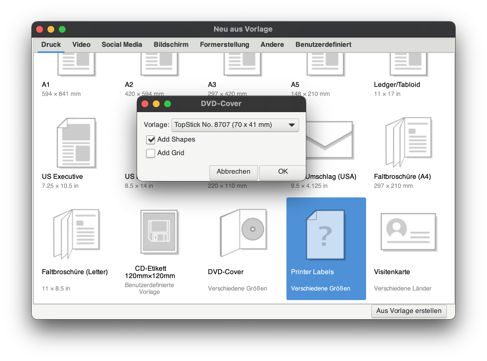

# inkscape-extension-printer-labels

This Inkscape extension will create print-ready label sheets without external tools.

## Installation

First make sure you have [Inkscape 1.x](https://inkscape.org/en/release/) installed.

Copy `template_printer_labels.inx` and `template_printer_labels.py` into your extension folder.

Once you restart Inkscape, a *new template* appears in the *Print* template menu. See also the official instructions for installing extensions: <https://inkscape.org/learn/faq/> (section “How to install new extensions…”).

Where is my Inkscape extension nfolder?

The extension folder ist typically in `~/.config/inkscape/extensions`. To find yours, try one of the following:

- Find the path in Inkscape: Edit > Preferences > System, open “User extensions” (e.g. on macOS: `/Users/<your username>/.config/inkscape/extensions`).
- Run `inkscape --user-data-directory`to find your config folder and create an `extensions` folder inside it.

